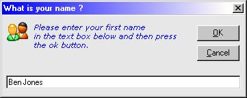



## DM Inputbox Replacement

### Description

Hi,

This is just a project I made that can be a replacement of the normal input box in Visual Basic.

With this new input-box you can change the fore color of the message also change the font

You can now even add your own icon just like you see on message boxes. please take a look at the screen shot,

Anyway hope you find it of some us, please vote if you do.
 
### More Info
 

             |
---                |---
**Submitted On**   |2001-08-22 01:58:24
**By**             |[dreamvb](https://github.com/Planet-Source-Code/PSCIndex/blob/master/ByAuthor/dreamvb.md)
**Level**          |Beginner
**User Rating**    |4.3 (13 globes from 3 users)
**Compatibility**  |VB 5\.0, VB 6\.0
**Category**       |[VB function enhancement](https://github.com/Planet-Source-Code/PSCIndex/blob/master/ByCategory/vb-function-enhancement__1-25.md)
**World**          |[Visual Basic](https://github.com/Planet-Source-Code/PSCIndex/blob/master/ByWorld/visual-basic.md)
**Archive File**   |[DM\_Inputbo1210248222002\.zip](https://github.com/Planet-Source-Code/dreamvb-dm-inputbox-replacement__1-38175/archive/master.zip)

